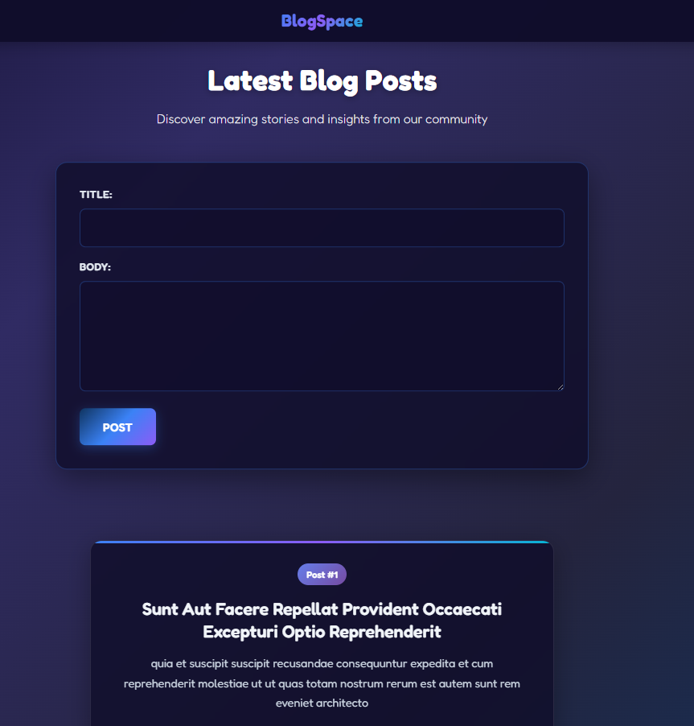
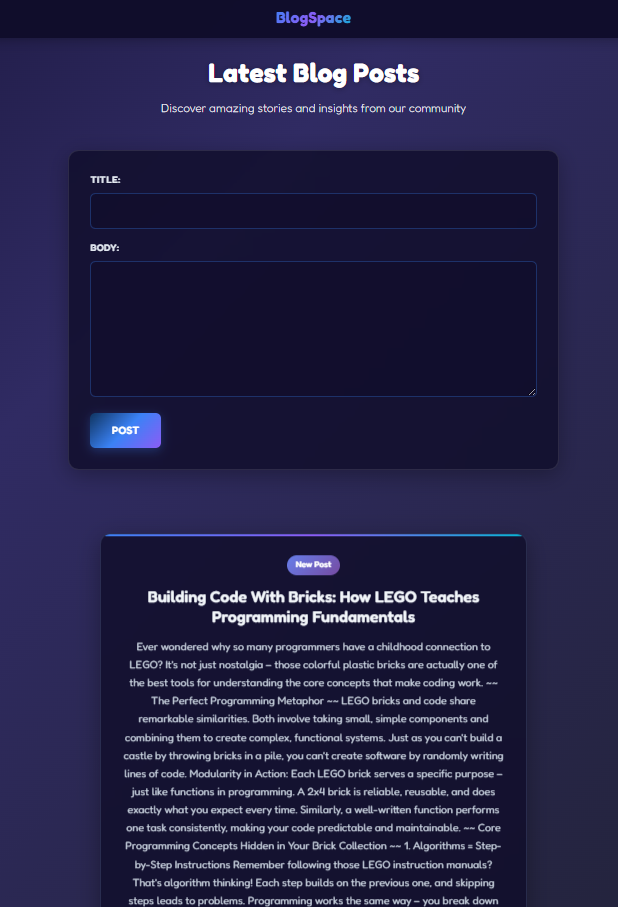
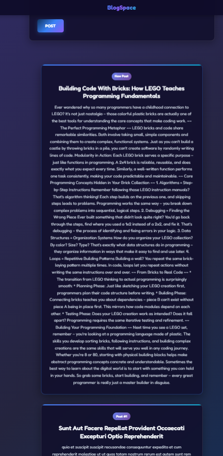

# BlogSpace

A simple and clean blogging app where users can view, create, and interact with blog posts.  
Deployed live at 👉 [BlogSpace Live](https://kvothe1387.github.io/BlogSpace/)

---

## 🚀 Features
- View a feed of blog posts
- Add new blog posts
- Responsive, minimal design
- Built with **HTML, CSS, and JavaScript**

---

## 🌐 Live Demo
[Click here to view the live site](https://kvothe1387.github.io/BlogSpace/)

---

## 📸 Screenshots

### Home Page


### Add Post



---

## 🛠️ Tech Stack
- **Frontend:** HTML, CSS, JavaScript  
- **Deployment:** GitHub Pages  

---

## 📂 Installation & Setup
If you’d like to run this project locally:

1. Clone the repo:
   ```bash
   git clone https://github.com/kvothe1387/BlogSpace.git
2. Navigate into the project folder:
   ```bash
   cd BlogSpace
3. Open index.html in your browser.

---

## 🤝 Contributing

Contributions are welcome!
If you’d like to add features or fix bugs:
* Fork the repo
* Create a new branch (git checkout -b feature-branch)
* Commit your changes
* Open a Pull Request

---

## 👨‍💻 Author

- GitHub: [David McCullough](https://github.com/kvothe1387)
- LinkedIn: [David McCullough](https://www.linkedin.com/in/davidmcc-webdev/)
- Portfolio: [My Portfolio](https://davidmcc.netlify.app/)
