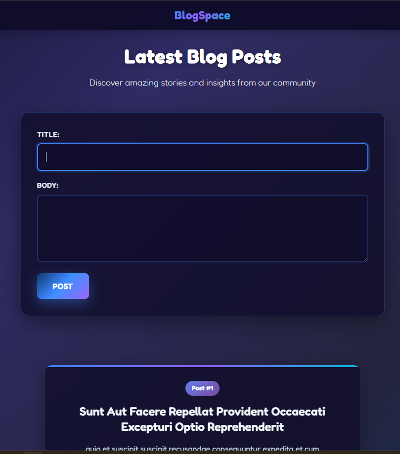

# BlogSpace

BlogSpace is a clean, minimalist blogging platform that lets users quickly share thoughts and stories. Perfect for writers, bloggers, or anyone who wants a simple way to publish content without the complexity of traditional blogging platforms. 
Deployed live at 👉 [BlogSpace Live](https://kvothe1387.github.io/BlogSpace/)

---

## 🚀 Features
* Real-time post creation and display
* Mobile-responsive design optimized for all devices
* Clean, distraction-free reading experience
* No registration required - start blogging immediately

---

## 🌐 Live Demo
[Click here to view the live site](https://kvothe1387.github.io/BlogSpace/)

---

## 📸 Screenshots

### Home Page


### Add Post


---

## 🛠️ Tech Stack


---

## 📂 Installation & Setup
If you’d like to run this project locally:

1. Clone the repo:
   ```bash
   git clone https://github.com/kvothe1387/BlogSpace.git
2. Navigate into the project folder:
   ```bash
   cd BlogSpace
3. Open index.html in your browser.

---

## Future Enhancements

* User authentication
* Post editing/deletion
* Comments system
* Search functionality

## 🤝 Contributing

Contributions are welcome!
If you’d like to add features or fix bugs:
* Fork the repo
* Create a new branch (git checkout -b feature-branch)
* Commit your changes
* Open a Pull Request

---

## 👨‍💻 Author

- GitHub: [David McCullough](https://github.com/kvothe1387)
- LinkedIn: [David McCullough](https://www.linkedin.com/in/davidmcc-webdev/)
- Portfolio: [My Portfolio](https://davidmcc.netlify.app/)
